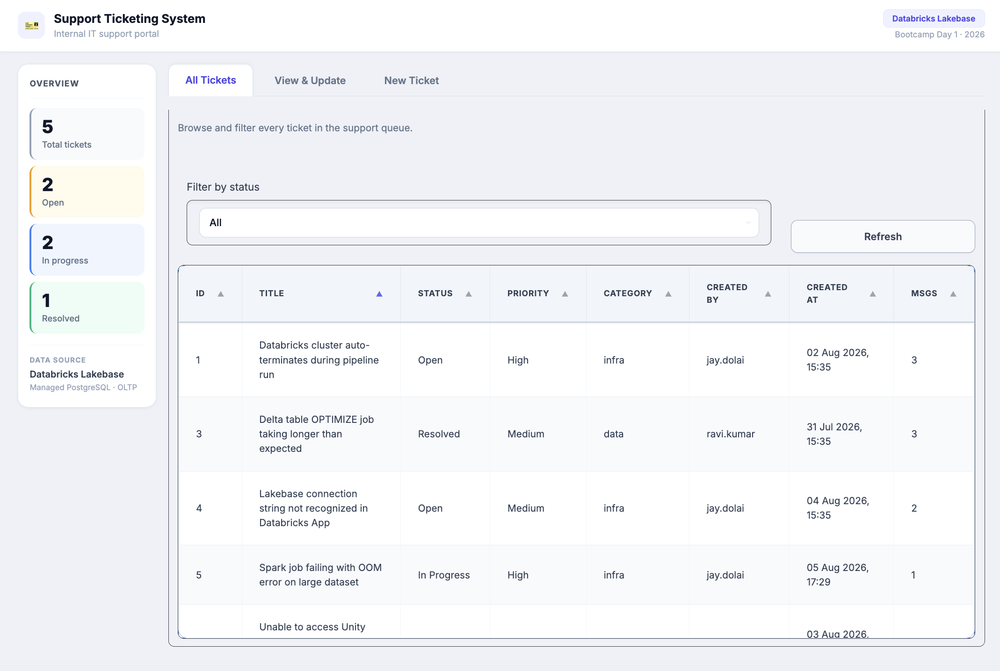
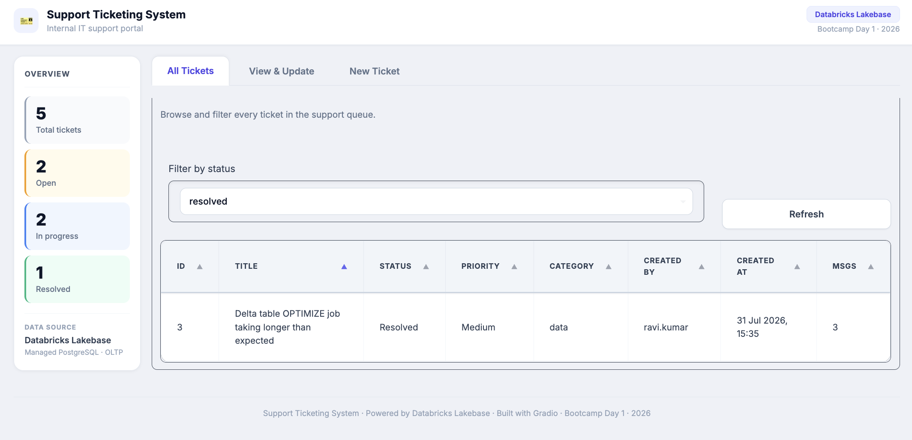
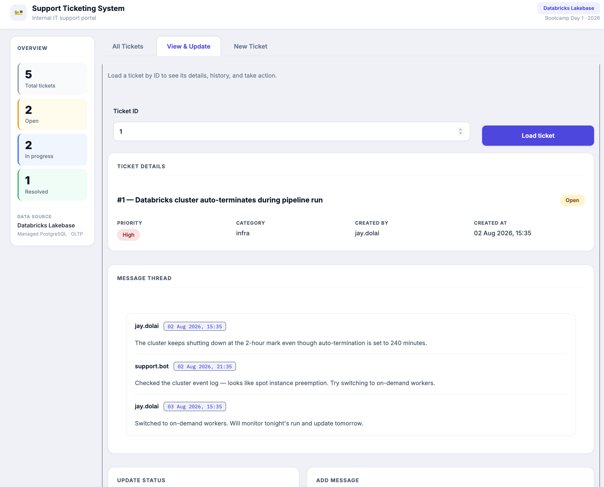
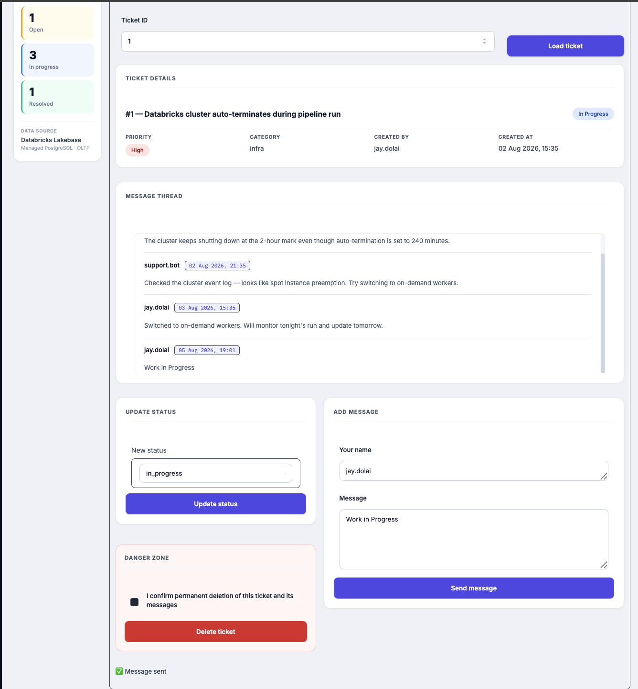
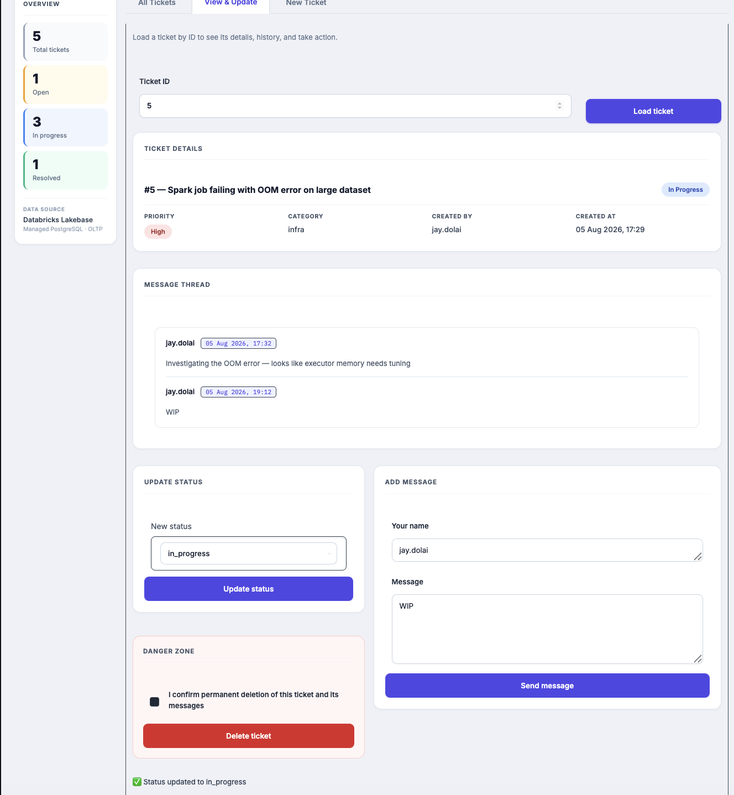
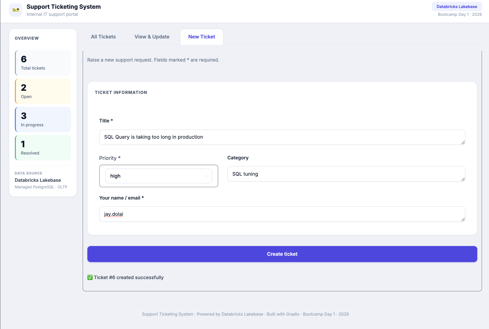
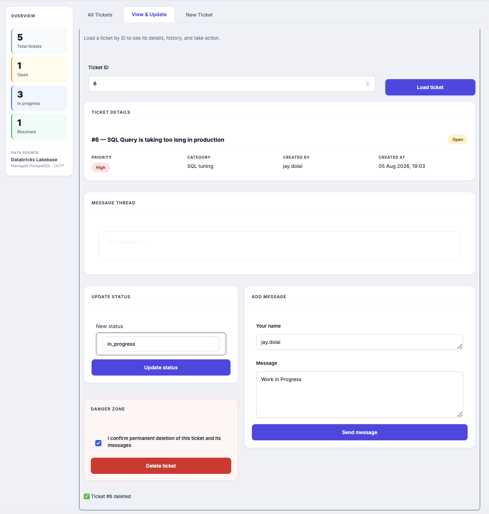
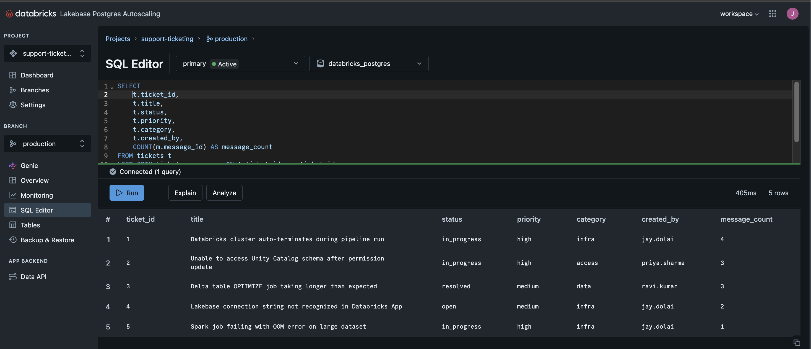

<div align="center">

# 🎫 Lakebase Support Ticketing System

**An internal IT support portal built on [Databricks Lakebase](https://docs.databricks.com/) (managed PostgreSQL OLTP) and deployed as a Databricks App.**

*Databricks Bootcamp — Day 1 Homework*

[](https://docs.databricks.com/aws/en/dev-tools/databricks-apps/)
[](https://docs.databricks.com/)
[](https://gradio.app)
[](https://python.org)
[](https://support-ticketing-7474654640109575.aws.databricksapps.com)

**🔗 Live App:** https://support-ticketing-7474654640109575.aws.databricksapps.com
**📄 Full write-up (PDF):** [`Lakebase_Support_Ticketing_System.pdf`](Lakebase_Support_Ticketing_System.pdf)

</div>



---

## Contents

1. [Overview](#overview)
2. [Screenshots](#screenshots)
3. [Architecture](#architecture)
4. [Why Lakebase instead of Delta Lake?](#why-lakebase-instead-of-delta-lake)
5. [Database Schema](#database-schema)
6. [Repository Structure](#repository-structure)
7. [How Authentication Works](#how-authentication-works)
8. [Build Phases](#build-phases)
9. [Running It Locally](#running-it-locally)
10. [Bonus Features](#bonus-features)
11. [Security Notes](#security-notes)
12. [Reflection](#reflection)

---

## Overview

A full-stack internal support system where users can:

| | Capability |
|---|---|
| 📋 | View every support ticket in a sortable table with live message counts |
| 🔍 | Filter the queue by status (`All` / `open` / `in_progress` / `resolved`) *(bonus)* |
| 🧵 | Open a ticket and read its full chronological message thread |
| ➕ | Create a new ticket with title, priority, category and requester |
| 💬 | Append a message to an existing ticket |
| 🔄 | Update a ticket's status |
| 📊 | Watch live ticket statistics update after every write *(bonus)* |
| 🗑️ | Delete a ticket behind an explicit confirmation checkbox *(bonus)* |

Every read and write goes to **Lakebase** — Databricks' managed PostgreSQL OLTP engine — over the
standard Postgres wire protocol. No Delta tables are involved in the request path.

**Tech stack**

| Layer | Choice |
|---|---|
| Frontend | Gradio 4.x (`gr.Blocks`, 3 tabs, ~370 lines of custom CSS) |
| Data access | `psycopg2` + `RealDictCursor`, all SQL isolated in `app/db.py` |
| Database | Lakebase — managed Postgres, project `support-ticketing`, branch `production` |
| Hosting | Databricks Apps, sourced directly from this GitHub repo |
| Auth | Service-principal OAuth (`client_credentials` → JWT), no PAT stored anywhere |

---

## Screenshots

### 1 · All Tickets — queue + live dashboard

The landing tab. A sticky sidebar shows Total / Open / In Progress / Resolved counts pulled from
Lakebase on every load, next to the full ticket table with status, priority, category, requester,
timestamp and message count.


### 2 · Filter by status *(bonus)*

Selecting `resolved` re-queries Lakebase with a `WHERE t.status = %s` predicate and narrows the
table to matching tickets only.



### 3 · View & Update — ticket detail + message thread

Loading a ticket by ID renders a detail card with colour-coded status and priority chips, followed
by the complete message thread in chronological order with author and timestamp per entry.



### 4 · Add a message

A reply is inserted into `ticket_messages` and the thread re-renders immediately, with inline
`✅ Message sent` feedback below the form.



### 5 · Update status

Changing ticket #5 to `in_progress` writes through to Lakebase, updates the detail card's status
chip, and increments the sidebar's In Progress counter — all in one round trip. The change survives
a full page refresh.



### 6 · New Ticket — validated creation form

Required fields (`Title`, `Your name / email`) are validated before the insert. On success the app
reports the new ticket ID and the sidebar total increments.



### 7 · Delete with confirmation *(bonus)*

The **Delete ticket** button is a no-op until the confirmation checkbox is ticked — the handler
returns `⚠️ Tick the confirmation box first` otherwise. The delete cascades to the ticket's messages
via the foreign key.



### 8 · Lakebase SQL Editor — data verified at the source

The same rows, queried directly against the `production` branch in the Lakebase SQL Editor —
proving the app's writes landed in Postgres, not in application memory.



---

## Architecture

```
+-------------------------------------------------------------------+
|                       Databricks Platform                          |
|                                                                    |
|   +----------------------+          +--------------------------+   |
|   |   Databricks App     |          |         Lakebase         |   |
|   |   (Gradio, Python)   |  <---->  |   (Managed PostgreSQL)   |   |
|   |                      |  :5432   |                          |   |
|   |   - All Tickets      |  TLS     |   tickets                |   |
|   |   - View & Update    |          |   ticket_messages        |   |
|   |   - New Ticket       |          |                          |   |
|   +----------------------+          +--------------------------+   |
|             |                                                      |
|             |  Auth: service-principal OAuth (client_credentials)  |
|             |  DATABRICKS_CLIENT_ID / _SECRET  ->  JWT  ->  psql   |
+-------------------------------------------------------------------+
                              |
                          (browser)
                          End User
```

Three tiers, one process:

- **`app/app.py`** — Gradio UI and event handlers. Contains zero SQL.
- **`app/db.py`** — connection management and every query in the system.
- **Lakebase** — the system of record. Two tables, three indexes, one foreign key.

---

## Why Lakebase instead of Delta Lake?

| Dimension | Delta Lake (Analytics) | Lakebase (OLTP) |
|---|---|---|
| Designed for | Batch reads, BI, ML | Transactional reads/writes |
| Latency | Seconds to minutes | Milliseconds |
| Consistency | Eventually consistent | ACID, row-level |
| Write pattern | Append / bulk merge | Insert / Update / Delete |
| Concurrency | File-level commits | Row-level locking |
| Best fit | Dashboards, pipelines | Apps, APIs, operational data |

A ticketing app is a stream of single-row inserts and updates from concurrent users. That is exactly
the workload Postgres is built for and exactly the workload a Delta table handles badly.

---

## Database Schema

```sql
CREATE TABLE tickets (
    ticket_id   SERIAL       PRIMARY KEY,
    title       TEXT         NOT NULL,
    status      TEXT         NOT NULL DEFAULT 'open',    -- open | in_progress | resolved
    priority    TEXT         NOT NULL DEFAULT 'medium',  -- low | medium | high
    category    TEXT,                                    -- e.g. infra, access, data, billing
    created_by  TEXT         NOT NULL,
    created_at  TIMESTAMPTZ  NOT NULL DEFAULT NOW()
);

CREATE TABLE ticket_messages (
    message_id   SERIAL       PRIMARY KEY,
    ticket_id    INT          NOT NULL REFERENCES tickets(ticket_id) ON DELETE CASCADE,
    message_text TEXT         NOT NULL,
    author       TEXT         NOT NULL,
    created_at   TIMESTAMPTZ  NOT NULL DEFAULT NOW()
);

CREATE INDEX idx_messages_ticket_id ON ticket_messages(ticket_id);
CREATE INDEX idx_tickets_status     ON tickets(status);
CREATE INDEX idx_tickets_priority   ON tickets(priority);
```

`ON DELETE CASCADE` is what makes "delete a ticket" a single statement — Postgres removes the
thread with it.

---

## Repository Structure

```
lakebase-support-ticketing/
│
├── README.md
├── Lakebase_Support_Ticketing_System.pdf   <- full write-up with screenshots
├── .gitignore
│
├── app/
│   ├── app.py            <- Gradio UI (3 tabs, handlers, custom CSS)
│   ├── db.py             <- Lakebase connection + all SQL
│   ├── app.yml           <- Databricks Apps entrypoint
│   └── requirements.txt
│
├── sql/
│   ├── 01_create_schema.sql   <- DDL: 2 tables, 3 indexes
│   └── 02_seed_data.sql       <- 4 tickets across 3 statuses, 11 messages
│
├── notebooks/
│   └── setup_lakebase.ipynb   <- optional programmatic setup path
│
└── screenshots/
    ├── 01-dashboard.png        05-update-status.png
    ├── 02-filter-status.png    06-create-ticket.png
    ├── 03-view-ticket.png      07-delete-confirm.png
    └── 04-add-message.png      08-lakebase-tables.png
```

---

## How Authentication Works

Lakebase rejects personal access tokens on OAuth-enabled connections — it wants a **JWT**. The
working flow:

1. Databricks Apps injects `DATABRICKS_CLIENT_ID` and `DATABRICKS_CLIENT_SECRET` for the app's
   own auto-generated service principal.
2. `db.py` POSTs those to `https://<workspace-host>/oidc/v1/token` with
   `grant_type=client_credentials` and `scope=all-apis`.
3. The returned `access_token` (a short-lived JWT) is URL-encoded and used as the **Postgres
   password**, with the client ID as the username:

   ```
   postgresql://<client_id>:<jwt>@<lakebase-host>/databricks_postgres?sslmode=require
   ```

4. The service principal was granted a Lakebase role on the `production` branch under
   **Roles & Databases**, so it can read and write both tables.

A fresh token is minted per connection, so nothing long-lived is ever cached or committed.

> **Note:** `app/app.yml` still declares a `LAKEBASE_CONN` secret env var left over from the
> initial PAT-based attempt. The running code does **not** read it — authentication is entirely
> via the injected service-principal credentials described above. It is harmless, but it can be
> removed from `app.yml` without affecting the app.

---

## Build Phases

| Phase | Description | Status |
|---|---|---|
| 1 | Lakebase project, schema + seed data | ✅ Complete |
| 2 | `db.py` — connection + query layer | ✅ Complete |
| 3 | `app.py` — Gradio UI | ✅ Complete |
| 4 | Databricks App deployment | ✅ Complete — **live** |
| 5 | Bonus features | ✅ Complete |

### Phase 1 — Lakebase setup

- Lakebase project `support-ticketing`, branch `production`, database `databricks_postgres`
- Schema created in the Lakebase SQL Editor ([`sql/01_create_schema.sql`](sql/01_create_schema.sql))
- Seeded **4 tickets** across all 3 statuses with **11 threaded messages**
  ([`sql/02_seed_data.sql`](sql/02_seed_data.sql)) — the screenshots show 5–6 tickets because
  further tickets were created live through the app during testing

Verification query:

```sql
SELECT t.ticket_id, t.title, t.status, t.priority,
       COUNT(m.message_id) AS message_count
FROM tickets t
LEFT JOIN ticket_messages m ON t.ticket_id = m.ticket_id
GROUP BY t.ticket_id, t.title, t.status, t.priority
ORDER BY t.ticket_id;
```

### Phase 2 — Data layer (`app/db.py`)

All SQL lives here, parameterised (`%s`) throughout — no string interpolation into queries.
Every function opens a connection, works in a `try/finally`, commits or rolls back, and closes.

| Function | Purpose |
|---|---|
| `get_oauth_token()` | Exchange service-principal credentials for a Lakebase JWT |
| `get_conn()` | Open a TLS `psycopg2` connection with `RealDictCursor` |
| `get_all_tickets(status_filter)` | All tickets + message counts, optional status filter |
| `get_ticket_by_id(id)` | Single ticket as a dict |
| `get_messages(ticket_id)` | Full thread, oldest first |
| `get_stats()` | Counts by status + total, for the sidebar |
| `create_ticket(title, created_by, priority, category)` | Insert, returns the new `ticket_id` |
| `add_message(ticket_id, text, author)` | Insert a threaded message |
| `update_status(ticket_id, new_status)` | Update status (validated against an allow-list) |
| `delete_ticket(ticket_id)` | Delete, cascading to messages |

### Phase 3 — UI (`app/app.py`)

A three-tab Gradio interface styled as a corporate helpdesk portal — light slate/indigo palette,
Inter typeface, white cards on a soft background, and a sticky sidebar dashboard:

- **All Tickets** — filter dropdown, refresh button, sortable table with live message counts
- **View & Update** — detail card, message thread, status control, add-message form, guarded delete
- **New Ticket** — validated creation form

Every mutation handler returns updated table/stats/thread state, so the sidebar and table stay in
sync without a manual refresh.

### Phase 4 — Deployment on Databricks Apps

| Setting | Value |
|---|---|
| App name | `support-ticketing` |
| Source | GitHub — `demonjd2026-afk/lakebase-support-ticketing`, branch `main`, path `app/` |
| Entrypoint | `python app.py` (via `app.yml`) |
| Port | `DATABRICKS_APP_PORT`, defaulting to `8000` |
| Access | App service principal granted a Lakebase role on the `production` branch |
| URL | https://support-ticketing-7474654640109575.aws.databricksapps.com |

**Smoke test — all passing**

- [x] Existing tickets load from Lakebase on page open
- [x] New ticket created via the form persists and appears in the list
- [x] Message added to a ticket persists and appears in the thread
- [x] Status updated and reflected immediately — survives a page refresh
- [x] Filter by status narrows the list correctly
- [x] Delete requires the confirmation checkbox

---

## Running It Locally

The app authenticates as a Databricks service principal, so local runs need the same three
variables that Databricks Apps injects in production. Create a service principal with OAuth
credentials in your workspace and grant it a Lakebase role first.

```bash
git clone https://github.com/demonjd2026-afk/lakebase-support-ticketing.git
cd lakebase-support-ticketing

python -m venv .venv && source .venv/bin/activate
pip install -r app/requirements.txt

export DATABRICKS_HOST="dbc-291b687e-da89.cloud.databricks.com"
export DATABRICKS_CLIENT_ID="<service-principal-application-id>"
export DATABRICKS_CLIENT_SECRET="<service-principal-oauth-secret>"

# app.py imports db.py as a sibling module, so run from inside app/
cd app && python app.py
```

The app then serves on `http://localhost:8000`.

Quick connection check without launching the UI:

```bash
cd app && python -c "import db; print(db.get_stats())"
```

The Lakebase host and database name are constants at the top of `app/db.py` — point them at your
own Lakebase instance if you are not using this one.

---

## Bonus Features

| Feature | Where |
|---|---|
| ✅ Priority + category | Schema, creation form, and table columns |
| ✅ Filter by status | Dropdown on the All Tickets tab |
| ✅ Input validation | Required-field checks with inline messages on create / message / status |
| ✅ Ticket statistics | Live sidebar dashboard, refreshed after every write |
| ✅ Delete with confirmation | Explicit checkbox required before the delete is accepted |
| ✅ Improved visual design | Custom CSS: status/priority chips, cards, sticky sidebar, Inter type |

---

## Security Notes

- **No credentials in source control.** No PAT, connection string, or secret is committed.
- **No static tokens.** The app authenticates as its own service principal and mints a
  short-lived JWT per connection.
- **TLS enforced** — every connection uses `sslmode=require`.
- **Parameterised SQL** everywhere (`%s` placeholders), so ticket titles and messages cannot
  inject SQL.
- **Status values allow-listed** in `update_status()` before reaching the database.
- **`.gitignore`** excludes `.env`, `*.pem`, `__pycache__/`, `.DS_Store`, and
  `.streamlit/secrets.toml`.

---

## Reflection

**What was the most difficult part?**
Getting the Databricks App to authenticate against Lakebase. Lakebase's OAuth connections require a
JWT access token, not a personal access token — several intermediate approaches (raw PAT, hardcoded
connection strings, mismatched hostnames) each failed with a different error. The working path was
to have the app's own service principal exchange its injected `DATABRICKS_CLIENT_ID` /
`DATABRICKS_CLIENT_SECRET` for a JWT via the OIDC `client_credentials` grant, and to grant that
principal a Lakebase role on the branch.

**How is Lakebase different from a traditional analytics table?**
Lakebase is managed PostgreSQL over the standard wire protocol: row-level ACID transactions and
millisecond read/write latency, which is what an interactive app doing single-row inserts and
updates needs. A Delta table is optimised for large, append-oriented batch writes and file-level
commits — using it for a live app's create/update/delete traffic would be both slow and awkward.

**What feature would you add next?**
An AI agent layer on the same Lakebase tables, using Databricks Model Serving to auto-triage new
tickets (suggest priority and category), draft reply messages, and summarise long threads on load.

---

<div align="center">

*Built by Jayanth Dolai · Databricks Bootcamp Day 1 · August 2026*

</div>
